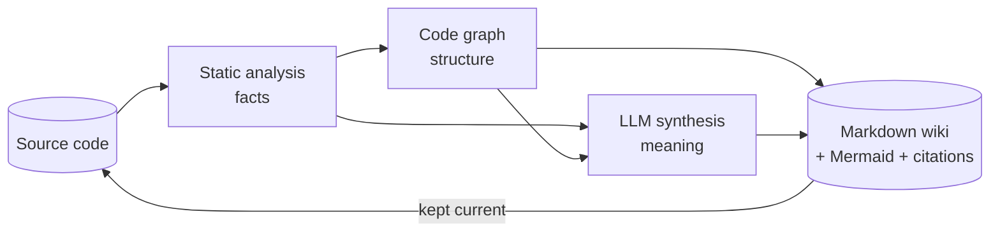
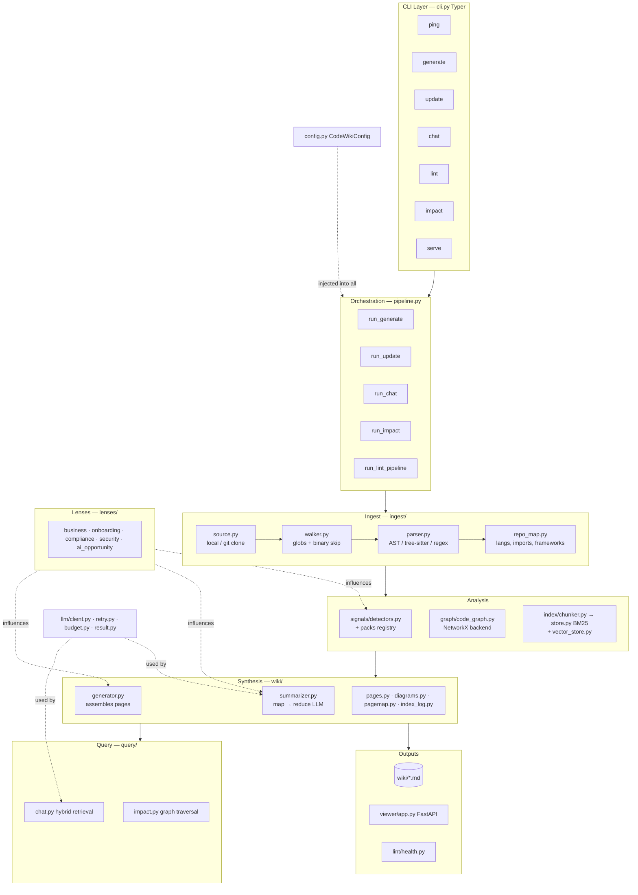
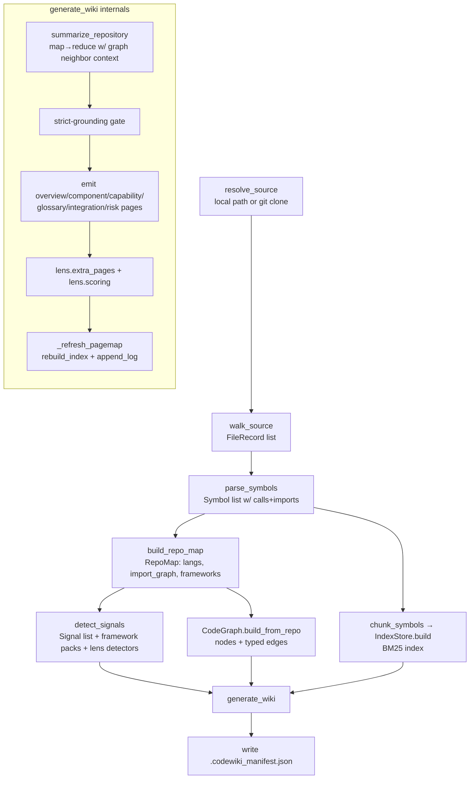
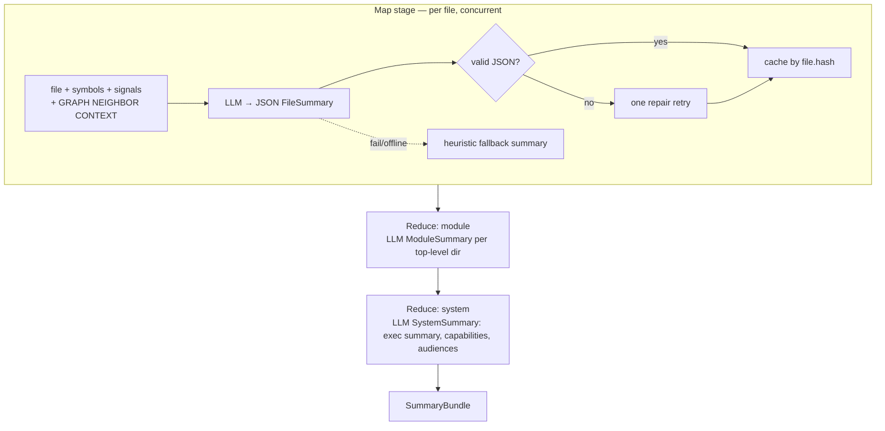
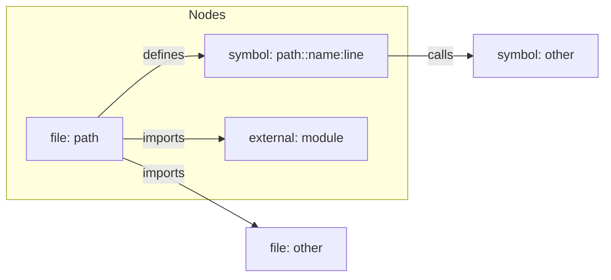
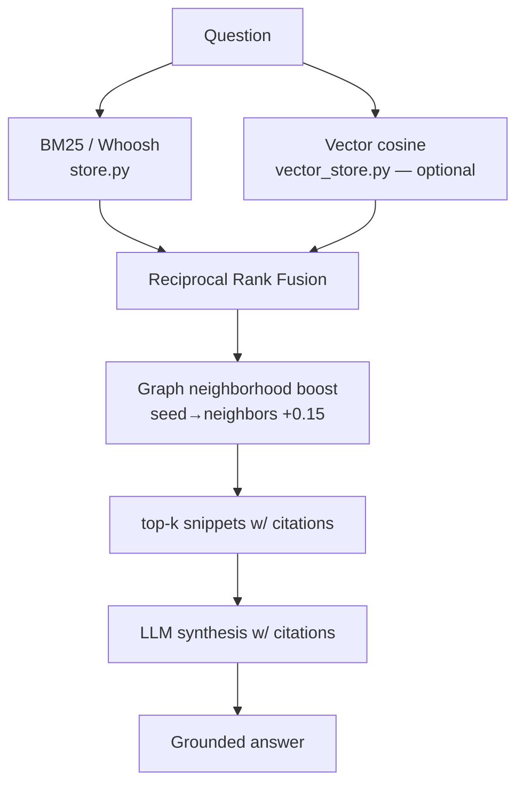

# CodeWiki — Architecture

> **What this document is:** a grounded, end-to-end explanation of *how CodeWiki actually works today*, anchored to the real modules in [`codewiki/`](../codewiki/). Read alongside [`WORKFLOWS.md`](WORKFLOWS.md) (per-command flows) and [`IMPROVEMENTS.md`](IMPROVEMENTS.md) (what's wrong and what's next).
>
> Last verified against the codebase: **2026-06-09.**

---

## 1. The core idea in one paragraph

CodeWiki turns a **codebase** into a **business-oriented, interlinked Markdown wiki**. It is *not* a pure "LLM reads files" tool. It is a **hybrid analysis system** with three cooperating engines: (1) **deterministic static analysis** extracts facts (files, symbols, imports, calls, framework signals); (2) a **code graph** turns those facts into structure (dependencies, call edges, impact, cycles); (3) an **LLM** synthesizes that grounded structure into readable prose (responsibilities, capabilities, business relevance) with mandatory code citations. The deterministic layers state *facts*; the LLM only *explains and synthesizes* — it never invents structure. The output is a persistent artifact that is **incrementally updated**, not regenerated from scratch.



---

## 2. Design philosophy (the "why")

| Principle | What it means in the code | Why |
|---|---|---|
| **Grounded over fluent** | Every summary prompt demands `citations: [path:Lx-Ly]`; lint *resolves* them | Trust beats prose; fights hallucination |
| **Facts vs. meaning split** | Graph/parser produce facts; LLM only narrates them | LLM never fabricates architecture |
| **Compounding artifact** | `update` diffs and rewrites only affected pages | Docs stay fresh at near-zero cost |
| **Provider-agnostic** | One `LLMClient` speaks OpenAI schema; `base_url`/`model`/`api_key` swap providers | Local (Ollama/vLLM) or hosted, same code |
| **Local-first, no server** | Whoosh BM25, NetworkX graph, FAISS/numpy vectors — all in-process | Privacy; runs on a laptop |
| **Graceful degradation** | LLM down → static fallback wiki; no vectors → BM25; no tree-sitter → regex/AST | Always produces *something* |
| **Pluggable everything** | Lenses, signal packs, parser backends, graph backend are swappable | Platform, not a one-off tool |

---

## 3. Layered architecture



---

## 4. The processing pipeline (end-to-end)

This is what `run_generate` in [pipeline.py](../codewiki/pipeline.py) actually does, in order:



**Stage-by-stage data contracts** (the dataclasses in [models.py](../codewiki/models.py) and [summarizer.py](../codewiki/wiki/summarizer.py)):

| Stage | Input | Output |
|---|---|---|
| `walk_source` | root path, config | `list[FileRecord]` `{path, lang, size, hash, text}` |
| `parse_symbols` | files | `list[Symbol]` `{id, kind, name, path, start/end_line, signature, docstring, calls[], imports[]}` |
| `build_repo_map` | files, symbols | `RepoMap` `{file_tree, language_stats, import_graph, frameworks, entrypoints}` |
| `detect_signals` | files, symbols | `list[Signal]` `{type, name, evidence[]}` |
| `chunk_symbols` | files, symbols | `list[Snippet]` `{text, cite, score, metadata}` |
| `CodeGraph.build_from_repo` | files, symbols, repo_map | graph of `GraphNode` + typed edges |
| `summarize_repository` | all of the above + graph | `SummaryBundle` `{file_summaries, module_summaries, system_summary}` |
| `generate_wiki` | everything | wiki pages + `pagemap` + `index.md` + `log.md` |

---

## 5. The three analysis engines

### 5.1 Static analysis (deterministic, zero-cost, 100% grounded)

- **[parser.py](../codewiki/ingest/parser.py)** — pluggable `LanguageParser`:
  - `PythonAstParser` — uses `ast`; extracts functions/classes, **populates `Symbol.calls`** (walks `ast.Call`), and `imports` (incl. relative `from .x import y`).
  - `TreeSitterLanguageParser` — Java/Go/C# (and JS/TS) *if* tree-sitter grammar wheels are installed (`tree_sitter_languages` or `tree_sitter_language_pack`).
  - `JsTsRegexParser` — regex fallback for JS/TS when tree-sitter is absent.
  - Backend chosen by `cfg.ingest.parser_backend` (`auto`/`ast`/`tree-sitter`).
- **[repo_map.py](../codewiki/ingest/repo_map.py)** — language stats, a raw `import_graph` (path → imported module names), framework hints, entrypoints.
- **[signals/detectors.py](../codewiki/signals/detectors.py)** — coarse regex signals (API routes, data models, queues, cron, env config, third-party integrations) **plus** framework-specific packs and lens-provided detectors.

### 5.2 The code graph (structure)

See §6 — this is the backbone.

### 5.3 LLM synthesis (meaning) — `wiki/summarizer.py`

The **map-reduce** brain:



Key properties (all verifiable in the code):
- **Graph-grounded prompts:** `_graph_neighbor_context_by_file` renders each file's imports, dependents, and top call targets and injects them as `neighbor_context` into the file-summary prompt. *This is what makes summaries aware of how a file connects to the rest of the system.*
- **Caching:** `SummaryCache` ([wiki/cache.py](../codewiki/wiki/cache.py)) stores each `FileSummary` keyed by `FileRecord.hash`. Unchanged file on re-run = **zero tokens**.
- **Structured output discipline:** `_extract_json_object` + `_repair_json_payload` + `_coerce_file_summary` force the output into a typed `FileSummary` or fall back gracefully.
- **Budget:** every call records real `usage` into `Budget` ([llm/budget.py](../codewiki/llm/budget.py)); `estimate_repository_tokens` powers `--dry-run`.

---

## 6. Knowledge graph — deep dive

> *"Code is a graph."* The graph is CodeWiki's **structural source of truth**. It exists to do the things an LLM cannot do reliably: trace dependencies, compute impact, detect cycles, and **constrain the LLM with real neighbors**.

### 6.1 What it's made of — [graph/code_graph.py](../codewiki/graph/code_graph.py)



- **Node kinds:** `file`, `symbol`, `external` (3rd-party/stdlib module).
- **Edge kinds:** `defines` (file→symbol), `imports` (file→file or file→external), `calls` (symbol→symbol).
- **Import resolution:** a `module → file` index resolves `codewiki.config` → `codewiki/config.py`; relative JS/TS imports (`./x`, `../x`, `/index.js`) are resolved; unresolved names become **external** nodes (kept visually distinct, never phantom-linked).

### 6.2 How it's stored — [graph/backend.py](../codewiki/graph/backend.py)

A `GraphBackend` ABC defines `add_node/add_edge/neighbors/ancestors/descendants/cycles/to_subgraph/...`. The only implementation today is **`NetworkXBackend`** (`nx.MultiDiGraph`, in-process). This abstraction is the **seam** for a future Kùzu backend (see [IMPROVEMENTS.md](IMPROVEMENTS.md)).

### 6.3 What the graph powers

| Consumer | How it uses the graph |
|---|---|
| **Summarizer** | `neighbor_context` (imports/dependents/calls) injected into file prompts → grounded, connected summaries |
| **Diagrams** ([diagrams.py](../codewiki/wiki/diagrams.py)) | `component_graph_diagram` walks internal nodes + `imports` edges; external nodes styled separately; capped at ~30 nodes with "+N more" |
| **Component pages** ([generator.py](../codewiki/wiki/generator.py)) | `get_file_dependencies` lists real depends-on relationships |
| **`impact`** ([query/impact.py](../codewiki/query/impact.py)) | `impact_analysis` = graph **ancestors** of a node → "what breaks if I change X" |
| **Retrieval** ([retriever.py](../codewiki/index/retriever.py)) | seeds from keyword hits → expands to graph neighbors → boosts in-neighborhood snippets |
| **Lens scoring** ([lenses/](../codewiki/lenses/)) | `lens.scoring(signals, graph)` can weight opportunities by structural centrality |

### 6.4 Why graph-first (vs. vectors-only)

The graph wins on **explainability** (follow typed edges), **relationship awareness** (calls vs. imports vs. defines), **impact radius** (native ancestor traversal), and **cycle detection**. Vectors win on **fuzzy/semantic recall**. CodeWiki uses **both**: graph for structure-truth, vectors for semantic reach (§7).

---

## 7. Retrieval architecture (hybrid) — `index/`

Used by `chat`. Three signals fused:



- **BM25** ([store.py](../codewiki/index/store.py)) — Whoosh; substring-count JSON fallback if Whoosh is unavailable.
- **Vectors** ([vector_store.py](../codewiki/index/vector_store.py)) — only when `embedding.enabled`; embeds snippets via the configured embedding endpoint, persists + signature-caches them, ranks with **FAISS → numpy → pure-Python** cosine (whichever is available).
- **Fusion** ([retriever.py](../codewiki/index/retriever.py)) — `_rrf_scores` blends rankings; `_apply_graph_neighborhood_boost` (or a metadata fallback when no graph is passed) nudges structurally-related snippets up.

---

## 8. Wiki output model — `wiki/`

### 8.1 Page anatomy — [pages.py](../codewiki/wiki/pages.py)
Every page = YAML frontmatter (`title, type, audience, sources, tags, confidence`) + `## Summary` + sections + optional `## Related` + `## Sources`.

### 8.2 Generated information architecture
```
wiki/
├─ AGENTS.md                      # how the wiki is maintained
├─ index.md                       # catalog of all pages (navigation root)
├─ log.md                         # append-only ingest/update/contradiction log
├─ 00-overview/
│  ├─ executive-summary.md        # LLM system summary (business)
│  ├─ system-context.md           # Mermaid context diagram
│  ├─ tech-stack.md               # languages / frameworks / entrypoints
│  └─ component-graph.md          # Mermaid dependency diagram (from graph)
├─ components/<component>.md       # per top-level dir: responsibility + deps + interface
├─ capabilities/<capability>.md    # business capability pages (from signals)
├─ domain/glossary.md             # domain terms from signals
├─ integrations/external-systems.md
├─ operations/{setup,risk-register}.md
└─ <lens-specific pages>          # e.g. ai-opportunity register
```

### 8.3 Provenance & incremental update — [pagemap.py](../codewiki/wiki/pagemap.py)
`_refresh_pagemap` writes `.codewiki_pagemap.json`: each `PageRecord` maps a page → its `source_files`, `source_symbols`, and the `file_hashes` at generation time. This reverse index is what makes `update` **targeted** (see [WORKFLOWS.md](WORKFLOWS.md) §Update) and powers page-level `impact`.

---

## 9. Extensibility model

| Extension point | Contract | Examples |
|---|---|---|
| **Lens** ([lenses/base.py](../codewiki/lenses/base.py)) | `system_prompt_addendum`, `extra_signal_detectors`, `scoring`, `extra_pages`, `page_templates` | `ai_opportunity`, `compliance`, `security`, `onboarding` |
| **Signal pack** ([signals/packs/](../codewiki/signals/packs/)) | `Callable[[files, symbols], list[Signal]]` in `PACK_REGISTRY` | `spring`, `fastapi`, `flask`, `express` |
| **Parser backend** ([parser.py](../codewiki/ingest/parser.py)) | `LanguageParser.parse(file) -> list[Symbol]` | AST, tree-sitter, regex |
| **Graph backend** ([backend.py](../codewiki/graph/backend.py)) | `GraphBackend` ABC | NetworkX (Kùzu is the planned seam) |
| **LLM provider** ([client.py](../codewiki/llm/client.py)) | OpenAI-compatible REST | OpenAI, Azure, Ollama, vLLM, … |

A lens is selected with `--lens`; it can add detectors (more signals), influence every summary prompt (`system_prompt_addendum`), score findings, and emit bespoke pages (e.g., the **AI Opportunity Register**).

---

## 10. Configuration & cost model

- **Config** ([config.py](../codewiki/config.py)) — six pydantic sub-models (`llm`, `ingest`, `wiki`, `generation`, `embedding`, `run`). Precedence: `codewiki.yaml` → `.env` → env vars → CLI flags.
- **Budget** ([budget.py](../codewiki/llm/budget.py)) — thread-safe token counter fed by real API `usage`; `token_budget` raises `BudgetExceeded` mid-run; `--dry-run` estimates before spending.
- **Caching** — file summaries cached by content hash; vectors signature-cached. Re-runs on unchanged code are near-free.
- **Resilience** ([retry.py](../codewiki/llm/retry.py)) — exponential backoff + jitter on 429/5xx/timeouts, honoring `Retry-After`.

---

## 11. Where to look next

- **How each command flows step-by-step:** [WORKFLOWS.md](WORKFLOWS.md)
- **What's wrong / inoptimal and the prioritized next steps:** [IMPROVEMENTS.md](IMPROVEMENTS.md)
- **Vision & requirements:** [PRD.md](PRD.md)
- **Phase 7 workstream plan:** [IMPLEMENTATION_PLAN_PHASE7.md](IMPLEMENTATION_PLAN_PHASE7.md)
