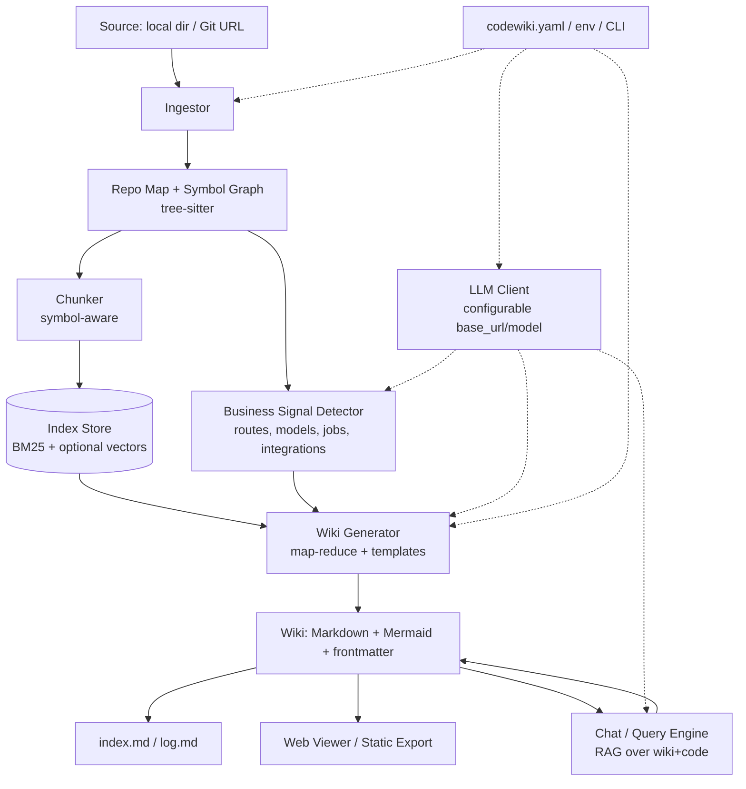

# Implementation Plan
## CodeWiki — Business-Oriented Knowledge Base Generator for Source Code

> Companion to [`PRD.md`](PRD.md). This doc covers technical architecture, the pipeline, phased milestones, the tech stack, and the data contracts between stages.

---

## 1. Guiding Principles

1. **Grounded over fluent** — every claim traces to code (`path:Lstart-Lend`). Trust beats prose.
2. **Compounding artifact** — generation *updates* the wiki; it doesn't blindly regenerate.
3. **Map-reduce for scale** — summarize file → module → system so huge repos fit in context.
4. **Provider-agnostic** — one thin LLM client; `base_url`/`model`/`api_key` swap providers with zero code change.
5. **Deterministic & resumable** — checkpoints, run manifests, pinned settings.
6. **Index-first, embeddings-optional** — `index.md` works at small scale; vectors kick in for large repos.

---

## 2. High-Level Architecture



### 2.1 Module layout (Python package)
```
codewiki/
├─ cli.py                  # Typer CLI: generate | update | chat | lint | serve
├─ config.py               # load+merge yaml/env/CLI; precedence; validation (pydantic)
├─ llm/
│  ├─ client.py            # OpenAI-compatible client: chat + embeddings
│  ├─ retry.py             # backoff, rate limiting, concurrency
│  └─ budget.py            # token accounting + cost estimate (dry-run)
├─ ingest/
│  ├─ source.py           # resolve local path / clone git / auth token
│  ├─ walker.py           # gitignore + include/exclude globs, binary skip
│  ├─ parser.py           # tree-sitter per language -> symbols
│  └─ repo_map.py         # file tree, import/dep graph, frameworks, entrypoints
├─ signals/
│  └─ detectors.py        # endpoints, db models, queues, jobs, env, integrations
├─ index/
│  ├─ chunker.py          # symbol-boundary chunking + metadata
│  ├─ store.py            # BM25 (whoosh/tantivy) + optional vector store
│  └─ retriever.py        # hybrid retrieve + cite
├─ wiki/
│  ├─ templates/          # jinja templates per page type
│  ├─ generator.py        # map-reduce summarize -> populate pages
│  ├─ diagrams.py         # build Mermaid (context, component, sequence, ER)
│  ├─ pages.py            # frontmatter, wikilinks, sources section
│  ├─ index_log.py        # maintain index.md + log.md
│  └─ updater.py          # diff-aware incremental update + contradiction flags
├─ query/
│  └─ chat.py             # RAG Q&A + "file-back as page"
├─ lint/
│  └─ health.py           # contradictions, stale, orphans, broken citations
└─ viewer/
   └─ app.py              # FastAPI viewer: render md+mermaid, nav, search, chat
```

---

## 3. The Pipeline (stage-by-stage data contracts)

### Stage 1 — Ingest
- **In:** source path/URL + config.
- **Do:** clone if URL; walk files honoring `.gitignore` + globs; skip binaries/vendored/build.
- **Out:** `FileRecord[] { path, lang, size, hash, text }`.

### Stage 2 — Parse & Repo Map
- **Do:** tree-sitter parse per language → symbols; build import/dependency graph; detect frameworks & entry points; language stats.
- **Out:** `Symbol[] { id, kind, name, path, start_line, end_line, signature, docstring, calls[], imports[] }` + `RepoMap`.

### Stage 3 — Business Signal Detection
- **Do:** heuristics + LLM to find API routes, DB models/migrations, message topics, scheduled jobs, feature flags, env/config keys, external SDKs/integrations.
- **Out:** `Signal[] { type, name, evidence: cite[] }` → seeds capabilities, glossary, integrations.

### Stage 4 — Chunk & Index
- **Do:** chunk by symbol; attach metadata + citation; build BM25 index; optionally embed (configurable embedding endpoint) for large repos.
- **Out:** searchable `IndexStore` returning `Snippet { text, cite, score }`.

### Stage 5 — Wiki Generation (map-reduce)
- **File-level:** summarize each file (responsibility, key symbols, business relevance) — cached by hash.
- **Module-level:** reduce file summaries → component pages.
- **System-level:** reduce module summaries → overview, capabilities, tech-stack, data-model.
- **Diagrams:** derive Mermaid from symbol/import graph + signals.
- **Out:** Markdown pages with frontmatter, wikilinks, Sources sections; `index.md` + `log.md` updated.

### Stage 6 — Query / Chat
- **Do:** retrieve relevant wiki pages (index-first) + code snippets → grounded answer w/ citations → optional file-back as new page.

### Stage 7 — Lint
- **Do:** verify citations resolve; detect stale (symbol gone / hash changed), orphan pages, contradictions, missing concept pages; emit report + suggestions.

### Stage 8 — Serve / Export
- **Do:** FastAPI viewer (render md + Mermaid, sidebar from `index.md`, search, chat panel) and/or static export.

---

## 4. Tech Stack

| Concern | Choice | Why |
|---|---|---|
| Language | **Python 3.11+** | Best parsing + LLM ecosystem |
| CLI | **Typer** | Ergonomic commands/flags |
| Config | **pydantic-settings + PyYAML** | yaml/env/CLI merge + validation |
| Parsing | **tree-sitter** (+ language grammars) | Robust multi-language symbols |
| Git | **GitPython / subprocess** | Clone, diff for incremental |
| Keyword search | **tantivy-py** or **Whoosh** | Local BM25, no server |
| Embeddings (opt) | OpenAI-compatible endpoint + **FAISS/Chroma** | Provider-agnostic vectors |
| LLM client | **httpx** + OpenAI-compatible schema | One client, any provider |
| Templates | **Jinja2** | Page scaffolding |
| Diagrams | **Mermaid** (text, rendered in viewer) | No native render dependency |
| Viewer | **FastAPI + HTMX/Jinja + mermaid.js + markdown-it** | Lightweight local app |
| Concurrency | **asyncio + anyio** | Parallel file summarization w/ limits |

> **No hard dependency on any single LLM vendor.** Local models (Ollama/vLLM/LM Studio) and hosted (OpenAI/Azure/OpenRouter/Together) all work via `base_url`+`model`.

---

## 5. The LLM Client (the configurable core)

```python
# llm/client.py  (sketch)
class LLMClient:
    def __init__(self, cfg: LLMConfig):
        self.base_url = cfg.base_url            # e.g. http://localhost:11434/v1
        self.model = cfg.model                  # e.g. qwen2.5-coder:32b
        self.api_key = os.environ[cfg.api_key_env] if cfg.api_key_env else cfg.api_key
        self.client = httpx.AsyncClient(base_url=self.base_url, timeout=cfg.timeout_s)

    async def chat(self, messages, **over) -> str: ...      # /chat/completions
    async def embed(self, texts) -> list[list[float]]: ...  # /embeddings
```
- Uniform OpenAI-compatible payloads → swap providers by config only.
- Wrapped by `retry.py` (backoff + rate limit + concurrency) and `budget.py` (token accounting, `--dry-run` cost estimate).

---

## 6. Phased Milestones

### Phase 0 — Scaffold & Config (foundation)
- Repo skeleton, `pyproject.toml`, lint.
- `config.py` with yaml/env/CLI precedence; `codewiki.yaml` sample.
- `LLMClient` with chat+embed + retry + a `codewiki ping` command to verify the endpoint.
- **Exit:** `codewiki ping` returns a model completion from any configured endpoint.

### Phase 1 — Ingest & Repo Map (MVP backbone)
- Source resolver (local + git clone + token), file walker (gitignore/globs), tree-sitter parsing for **Python + JS/TS** first.
- Repo map: file tree, language stats, import graph, entry points.
- **Exit:** `codewiki generate --source X` prints a structured repo map JSON.

### Phase 2 — Wiki Generation v1 (the demo-able core)
- File→module→system map-reduce summarization with caching by hash.
- Page templates: overview, executive-summary, tech-stack, component pages, glossary.
- `index.md` + `log.md` maintenance; citations in Sources sections.
- **Exit:** running on a medium repo produces a coherent, linked `wiki/` with an Executive Summary.

### Phase 3 — Business Lens & Diagrams (the differentiator)
- Signal detectors (routes, models, jobs, integrations) → capability pages + data-model + integrations.
- Mermaid: system context, component graph, ER, key sequence flows.
- Business/Technical audience toggle in templates.
- **Exit:** capability catalog + diagrams that a PM can read end-to-end.

### Phase 4 — Index, Retrieval & Chat
- Symbol-aware chunker, BM25 store, optional embeddings.
- `codewiki chat` grounded Q&A with citations + "file-back as page".
- **Exit:** ask "how does X work?" → grounded answer → saved page appears in `index.md`.

### Phase 5 — Incremental Update & Lint (keeps it alive)
- Diff-aware `update` (git diff / hash diff) touching only affected pages; contradiction flags.
- `lint`: citation resolution, stale/orphan/contradiction detection + gap suggestions.
- **Exit:** change code → `update` refreshes only impacted pages; `lint` reports a clean/issue list.

### Phase 6 — Viewer & Export (shareable)
- FastAPI viewer: nav from `index.md`, Mermaid render, search, chat panel.
- Static export (MkDocs/Docusaurus-style).
- **Exit:** `codewiki serve` opens a browsable wiki with working chat.

### Phase 7 — Scale & Hardening
- More languages (Java, Go, C#), checkpoint/resume, token budgets + `--dry-run`, caching, run manifest, cost reporting in `log.md`.
- **Exit:** completes a ~500k+ LOC repo within budget, resumable.

---

## 7. CLI Surface

```bash
codewiki ping                              # verify LLM endpoint/config
codewiki generate --source <path|url>      # full build
codewiki generate --source . --dry-run     # estimate cost/tokens only
codewiki update  --source .                # diff-aware refresh
codewiki chat    "How do refunds work?"    # grounded Q&A (+ file-back prompt)
codewiki lint                              # health report
codewiki serve   --port 8080               # local web viewer
```

---

## 8. Page Template (every page conforms)

```markdown
---
title: Refund Processing
type: capability            # capability|component|concept|workflow|integration|overview
audience: business          # business|technical|both
sources: ["src/payments/refund.py:L20-L88", "src/api/routes.py:L140-L165"]
last_updated: 2026-06-08
confidence: high            # high|medium|low(inferred)
tags: [payments, refunds]
---

## Summary
Plain-language: what this does for the business and who uses it.

## How it works
Grounded explanation. Inline citations like [`refund.py:L34`](...).

## Diagram
```mermaid
sequenceDiagram
  ...
```

## Related
- [[Payments Service]] · [[Refunds Workflow]] · [[Glossary: Chargeback]]

## Sources
- src/payments/refund.py:L20-L88
```

---

## 9. Sequencing & First Steps

1. **Lock the open questions** in PRD §12 (stack=Python assumed; viewer custom-FastAPI; grounding=strict-by-default).
2. Build **Phase 0** (scaffold + configurable LLM client + `ping`) — proves the configurable-endpoint requirement immediately.
3. Build **Phase 1–2** to a demo on a real medium repo.
4. Layer the **business lens (Phase 3)** — the actual differentiator — and iterate prompts on a real codebase.

---

## 10. Stretch Ideas (post-v1)
- Obsidian vault output + Dataview dashboards (capabilities by area, risk heatmap).
- Marp slide-deck generation ("Architecture in 10 slides") from wiki.
- MCP server so other agents can query the wiki as a native tool.
- CI bot: on PR merge, auto-`update` the wiki and comment a changelog.
- Multi-repo / monorepo capability map across services.
- "Confidence/uncertainty" highlighting for inferred (non-grounded) claims.

---

*This plan is intentionally modular — phases are independently shippable. Start with Phase 0 to validate the configurable LLM core, then grow the wiki outward.*
