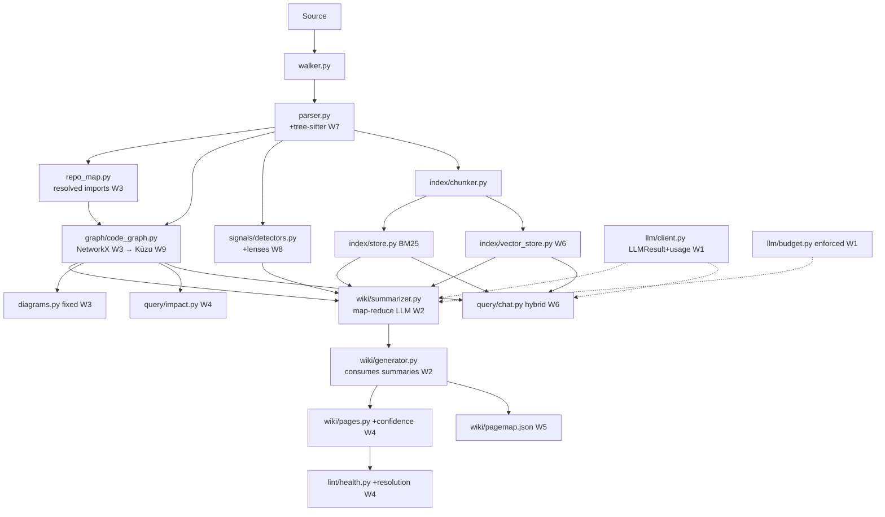
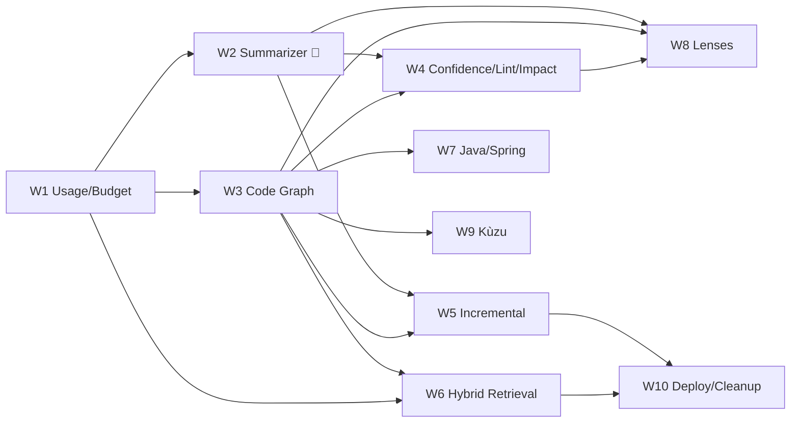

# Implementation Plan — Phase 7+ (Architectural Hardening & Intelligence)
## CodeWiki — Business-Oriented Knowledge Base Generator for Source Code

> Companion to [`PRD.md`](PRD.md) and [`IMPLEMENTATION_PLAN.md`](IMPLEMENTATION_PLAN.md).
> This document turns the review findings (Sections A–E in [`logs/improve.md`](logs/improve.md)) into a single, sequenced, dependency-aware build plan.
>
> **Guiding principle:** *Turn on the brain before adding the graph; build the graph before the fancy retrieval; keep everything grounded and language-agnostic.*

---

## 0. How To Read This Plan

**Effort legend** (relative size, not calendar time):
- **S** — localized change, 1–3 files, no new dependency.
- **M** — new module + integration across a few files.
- **L** — cross-cutting; multiple modules and/or a new dependency.

**Risk legend:** Low / Med / High — likelihood of rework, hidden complexity, or regressions.

**Status tags used per task:** `[new]` create file/module · `[edit]` modify existing · `[test]` test work · `[dep]` dependency change.

Each workstream lists: **Goal → Files → Tasks → Data contract → Acceptance criteria → Effort/Risk → Depends on.**

---

## 1. Locked Decisions (from planning Q&A)

| # | Decision | Consequence for this plan |
|---|---|---|
| D1 | **Language-agnostic; Python/JS first.** Java/Spring is *not* the sequencing driver. | Multi-language + Spring pack (W7) stays late; everything else validated on Python/JS first. |
| D2 | **Graph store: NetworkX now → Kùzu as scale path. No Neo4j in v1.** | W3 builds on an in-process `GraphBackend` interface; Kùzu is a drop-in adapter (W9). |
| D3 | **Cover all of Sections A–E** as one comprehensive phased plan. | Ten workstreams W1–W10 below. |
| D4 | **New file**, existing `IMPLEMENTATION_PLAN.md` left intact. | This doc is the authoritative Phase 7+ plan. |

---

## 2. Current State — Real vs. Stub (grounded)

This is the honest baseline the plan corrects. Anchored to the code as it stands.

| Area | File(s) | Reality today | Target |
|---|---|---|---|
| Wiki synthesis | `wiki/generator.py` | **Static f-strings + regex counts; no LLM import** | LLM map-reduce (W2) |
| Token/cost | `llm/client.py`, `llm/budget.py`, `cli.py` | `chat()` drops `usage`; `ping` records hardcoded 20/10; dry-run = `words*1.35` | Real `usage` everywhere (W1) |
| Incremental update | `wiki/updater.py` | Diffs files, then **full regenerate** | Targeted page regen + contradiction flags (W5) |
| Dependency graph | `ingest/repo_map.py`, `wiki/diagrams.py` | `import_graph` = unresolved module names; `Symbol.calls` never populated; diagrams draw phantom edges | Resolved internal graph + call edges (W3) |
| Multi-language | `ingest/parser.py` | Python (`ast`) + JS/TS (regex) only; others → blind 120-line chunks | tree-sitter grammars + Spring pack (W7) |
| Vectors | `index/store.py`, `index/retriever.py` | Whoosh BM25 + substring fallback; `embed()` unused; no vector store | Hybrid graph+BM25+vectors (W6) |
| Confidence | `wiki/pages.py` | No `confidence` frontmatter field | Per-claim confidence (W4) |
| Citation health | `lint/health.py` | Regex-matches citation *strings*; never resolves them | Citation **resolution** (W4) |
| Misc | `query/chat.py`, `ingest/walker.py` | `datetime.utcnow()` deprecated; chat reads first 6 pages alphabetically; walker holds all file text in memory | Cleanups (W10) |

---

## 3. Target Architecture



**New modules to create:**
- `codewiki/llm/result.py` — `LLMResult` dataclass (W1)
- `codewiki/wiki/summarizer.py` — map-reduce LLM summarization (W2)
- `codewiki/wiki/cache.py` — hash-keyed summary cache (W2)
- `codewiki/graph/__init__.py`, `codewiki/graph/code_graph.py`, `codewiki/graph/backend.py` (W3, W9)
- `codewiki/index/vector_store.py` — embeddings index (W6)
- `codewiki/query/impact.py` — impact traversal (W4)
- `codewiki/wiki/pagemap.py` — page↔source reverse index (W5)
- `codewiki/lenses/` — lens packs (base, onboarding, compliance, security, ai_opportunity) (W8)

---

## 4. New Data Contracts

Add to `codewiki/models.py` (or co-located in new modules where noted):

```python
# llm/result.py  (W1) — replaces bare-string return from client.chat()
@dataclass(slots=True)
class LLMResult:
    text: str
    usage: dict          # {"prompt_tokens": int, "completion_tokens": int, "total_tokens": int}
    model: str
    finish_reason: str = ""

# wiki/summarizer.py  (W2)
@dataclass(slots=True)
class FileSummary:
    path: str
    responsibility: str          # what the file does (technical)
    business_relevance: str      # what it does for the business
    key_symbols: list[str]
    citations: list[str]         # path:Lx-Ly proving each claim
    confidence: str              # high | medium | low
    source_hash: str             # FileRecord.hash for cache invalidation

@dataclass(slots=True)
class ModuleSummary:
    name: str
    responsibility: str
    capabilities: list[str]
    files: list[str]
    citations: list[str]
    confidence: str

@dataclass(slots=True)
class SystemSummary:
    executive_summary: str
    capabilities: list[str]
    audiences: dict[str, str]    # {"business": "...", "technical": "..."}
    confidence: str

# graph/code_graph.py  (W3)
# Node kinds: "file" | "symbol" | "external"
# Edge kinds: "imports" | "calls" | "defines" | "route_handler" | "reads_model"
@dataclass(slots=True)
class GraphNode:
    id: str
    kind: str
    label: str
    meta: dict[str, str] = field(default_factory=dict)

# wiki/pagemap.py  (W5)
@dataclass(slots=True)
class PageRecord:
    page: str                    # relative wiki path
    source_files: list[str]
    source_symbols: list[str]
    file_hashes: dict[str, str]  # file -> hash at generation time
    human_edited: bool = False
```

Also: **populate the existing-but-empty `Symbol.calls`** (W3) and **add `confidence` to page frontmatter** in `wiki/pages.py` (W4).

---

## 5. Config Additions

Extend `codewiki/config.py` (all backward-compatible defaults):

```yaml
generation:
  lens: "business"          # business | onboarding | compliance | security | ai_opportunity   (W8)
  map_reduce_concurrency: 4 # parallel file summaries                                          (W2)
  summary_cache: true       # reuse cached file summaries by hash                              (W2)
embedding:
  enabled: false            # turn on vector index                                             (W6)
  store: "faiss"            # faiss | numpy                                                     (W6)
graph:
  backend: "networkx"       # networkx | kuzu                                                  (W3/W9)
  emit_diagrams: true
limits:
  token_budget: null        # already exists; now actually enforced                            (W1)
```

New `RunConfig`/`WikiConfig`/new `GraphConfig`,`EmbeddingConfig`,`GenerationConfig` sub-models mirror the existing pattern (`env_prefix="CODEWIKI_<SECTION>_"`).

---

## 6. Workstreams

### W1 — LLM Result Plumbing & Real Budget *(fixes A2; review step 7.2)*

**Goal:** Every LLM call returns real token usage; budget is enforced; `--dry-run` is honest. This is the measurement substrate for all later work — do it **first**.

**Files:** `llm/result.py` `[new]`, `llm/client.py` `[edit]`, `llm/budget.py` `[edit]`, `cli.py` `[edit]`, `query/chat.py` `[edit]`, `pipeline.py` `[edit]`.

**Tasks:**
1. `[new]` `LLMResult` dataclass.
2. `[edit]` `client.chat()` → return `LLMResult` (parse `data["usage"]`, `choices[0].message.content`, `finish_reason`). **Breaking change.**
3. `[edit]` Update both call sites that treat the return as `str`: `cli.ping` and `query/chat._llm_answer`. Add a tiny `.text` access; thread `usage` into a passed-in `Budget`.
4. `[edit]` `budget.py` — add `estimate(text)` helper (single source of truth for the `words*1.35` heuristic) and `enforce()` that raises `BudgetExceeded` mid-run.
5. `[edit]` `cli.ping` — replace hardcoded `record(20,10)` with real `result.usage`.
6. `[edit]` `--dry-run` in `cli.generate` — use `budget.estimate()` over the **prompts actually built** by the summarizer (W2 wires this once W2 lands; until then estimate over file text as today but via the shared helper).

**Acceptance:** `codewiki ping --show-config` prints real token counts from the endpoint; a unit test asserts `LLMResult.usage` is populated from a mocked response; budget raises at the configured ceiling.

**Effort:** S–M · **Risk:** Low · **Depends on:** none.

---

### W2 — Map-Reduce Summarizer: *Turn On The Brain* *(fixes A1; review step 7.1)*

**Goal:** Replace static template text with LLM-synthesized, grounded content. This *is* the product.

**Files:** `wiki/summarizer.py` `[new]`, `wiki/cache.py` `[new]`, `wiki/generator.py` `[edit]`, `pipeline.py` `[edit]`.

**Design — three reduce levels:**
1. **Map (file):** for each `FileRecord`, build a prompt with (a) the file text (chunk if > model budget), (b) its **graph neighbors** once W3 lands (imports/callers), (c) detected signals touching it. LLM returns a `FileSummary` (JSON-structured, citations mandatory). **Cache** by `file.hash` → `cache_dir/summaries/<hash>.json`; cache hit = zero tokens.
2. **Reduce (module):** group files by top-level dir (later: graph community W3) → `ModuleSummary`.
3. **Reduce (system):** all module summaries + `RepoMap` + signals → `SystemSummary` (executive summary, capability list, per-audience text).

**Generator refactor:** `wiki/generator.py` stops emitting hardcoded `business_summary`/`technical_summary`. It consumes `SystemSummary`/`ModuleSummary`/`FileSummary` to fill: executive summary, component pages, capability pages, glossary. Static strings remain only as **fallbacks when the endpoint is unavailable** (preserve current offline behavior).

**Concurrency:** summarize files in parallel honoring `generation.map_reduce_concurrency` and `run.concurrency`, using the existing `with_retry`. Enforce `Budget` between stages (W1).

**Structured output contract (file map prompt):**
```json
{ "responsibility": "...", "business_relevance": "...",
  "key_symbols": ["..."], "citations": ["path:Lx-Ly"], "confidence": "high|medium|low" }
```
Validate/repair JSON (one retry with a "return valid JSON only" nudge) before trusting it.

**Acceptance:** on a real medium Python repo, the executive summary and ≥3 capability pages contain LLM-written prose with resolvable citations; a second run is near-zero-token (cache hit); offline run still produces the fallback wiki.

**Effort:** L · **Risk:** Med · **Depends on:** W1 (budget/usage); *benefits from* W3 (neighbor grounding) but does not block on it.

---

### W3 — Code Graph Foundation *(fixes A4; review step 7.3; Section D core)*

**Goal:** A correct, typed, in-process code graph that fixes diagrams, constrains the LLM (anti-hallucination), and unlocks `impact`/cycles.

**Files:** `graph/__init__.py` `[new]`, `graph/backend.py` `[new]`, `graph/code_graph.py` `[new]`, `ingest/parser.py` `[edit]`, `ingest/repo_map.py` `[edit]`, `wiki/diagrams.py` `[edit]`, `pipeline.py` `[edit]`. `[dep]` add `networkx`.

**Tasks:**
1. **Resolve imports → internal files.** Build a `module → path` index from repo file paths. Python: `codewiki.config` → `codewiki/config.py`. JS/TS: resolve `./x`, `../x`, index files. Mark unresolved (`os`, `httpx`) as **external** nodes.
2. **Populate `Symbol.calls`.** In `_parse_python`, walk `ast.Call` within each function body; record callee names; best-effort resolve to symbol ids. (JS/TS: regex call capture, lower fidelity — acceptable.)
3. **`GraphBackend` interface** (`add_node/add_edge/neighbors/ancestors/descendants/cycles/to_subgraph`) with a `NetworkXBackend` implementation (`MultiDiGraph`). This interface is the seam for Kùzu (W9).
4. **`CodeGraph`** builds nodes (file/symbol/external) + typed edges (imports/calls/defines) from `symbols` + resolved `repo_map`.
5. **Fix diagrams.** `component_graph_diagram` consumes `CodeGraph`: internal-only by default, external nodes styled distinctly, **no phantom edges**; cap node count with “+N more”.

**Acceptance:** component diagram contains only nodes that exist; internal vs external visually distinct; `graph.cycles()` returns known cycles on a fixture; `Symbol.calls` non-empty on a fixture with function calls.

**Effort:** L · **Risk:** Med · **Depends on:** none (but W2 should be wired to consume neighbors once both exist).

---

### W4 — Confidence, Citation Resolution, Lint & Impact *(Section B; review step 7.7)*

**Goal:** Make grounding *verifiable* and expose structural insight.

**Files:** `wiki/pages.py` `[edit]`, `lint/health.py` `[edit]`, `query/impact.py` `[new]`, `cli.py` `[edit]`.

**Tasks:**
1. `[edit]` `write_page` — add `confidence` to frontmatter; thread it from summaries (W2). Strict-grounding gates on `confidence == low` per policy (see Open Q4).
2. `[edit]` `lint/health.py` — **resolve** every `path:Lx-Ly`: file exists, line range valid, (optional) symbol still present. Report `stale_citations` and `unresolved_citations` distinct from "missing". Flag fake `:L1-L1` placeholders.
3. `[new]` `query/impact.py` — `impact(symbol_or_file)` traverses `CodeGraph` ancestors (who depends on this) → affected files + wiki pages (via pagemap W5).
4. `[edit]` `cli.py` — `codewiki impact <symbol>` command; extend `lint` output with the new citation categories.

**Acceptance:** lint flags a deliberately broken citation in a fixture; `codewiki impact <symbol>` lists upstream dependents; pages carry a `confidence` field.

**Effort:** M · **Risk:** Low · **Depends on:** W3 (impact needs graph), W5 (page↔source map for page-level impact).

---

### W5 — True Incremental Update *(fixes A3; review step 7.4)*

**Goal:** `update` regenerates only what changed, flags contradictions, preserves human edits.

**Files:** `wiki/pagemap.py` `[new]`, `wiki/updater.py` `[edit]`, `wiki/generator.py` `[edit]`, `wiki/index_log.py` `[edit]`.

**Tasks:**
1. `[new]` `pagemap.py` — maintain `wiki/.codewiki_pagemap.json` (`PageRecord[]`): page → source files/symbols + file hashes at gen time.
2. `[edit]` `generator.py` — write/refresh `PageRecord` as each page is produced.
3. `[edit]` `updater.py` — replace blanket `generate_wiki(...)` with: diff files → resolve **affected pages** via pagemap → re-summarize only changed files (cache handles the rest) → re-reduce affected modules + system → rewrite only those pages.
4. **Contradiction flag:** if a regenerated page's core claim/summary materially differs from the stored one, append `## [date] contradiction | <page>` to `log.md` and set `frontmatter.contradiction: true`.
5. **Preserve human edits:** if `PageRecord.human_edited` or a `<!-- codewiki:locked -->` marker is present, skip or write a `.proposed.md` sibling instead of overwriting.

**Acceptance:** changing one file regenerates only its page(s) (token count ≪ full run); a locked page is not overwritten; a contradiction is logged when a claim flips.

**Effort:** L · **Risk:** Med · **Depends on:** W2 (summaries), W3 (symbol mapping helps precision).

---

### W6 — Hybrid Retrieval: Vectors + Graph Scope *(fixes A6; review step 7.5)*

**Goal:** Retrieval = graph locates the neighborhood → BM25 + vectors rank within it → LLM synthesizes.

**Files:** `index/vector_store.py` `[new]`, `index/retriever.py` `[edit]`, `index/store.py` `[edit]`, `query/chat.py` `[edit]`, `config.py` `[edit]`. `[dep]` optional `faiss-cpu` (fallback: numpy cosine).

**Tasks:**
1. `[new]` `vector_store.py` — build embeddings via `client.embed()` over snippets (batched, cached in `cache_dir/vectors`); persist index; cosine search. FAISS if available, else numpy.
2. `[edit]` `retriever.py` — **reciprocal-rank fusion** of BM25 + vector results; optional **graph scoping** (seed symbols from keyword match → expand neighbors → boost in-neighborhood snippets).
3. `[edit]` `query/chat.py` — use hybrid retriever; read relevant pages via `index.md` (not first-6-alphabetical — see W10).
4. `[edit]` `config.py` — `embedding.enabled/store`; guard so embeddings stay strictly optional (privacy/offline parity).

**Acceptance:** with `embedding.enabled=true`, a semantic query ("where's the retry logic?") returns the right snippet that BM25 alone misses; with it `false`, behavior matches today.

**Effort:** L · **Risk:** Med · **Depends on:** W3 (graph scoping), W1 (usage for embed cost).

---

### W7 — Multi-Language via tree-sitter + Spring Pack *(fixes A5; review step 7.6)*

**Goal:** Real symbols for Java/Go/C# etc.; Spring signal pack. **Sequenced late per Decision D1** (language-agnostic, Python/JS first) — but designed so the banking use case is unblocked when prioritized.

**Files:** `ingest/parser.py` `[edit]`, `signals/detectors.py` `[edit]`, `signals/packs/spring.py` `[new]`, `config.py` `[edit]`. `[dep]` `tree-sitter` + grammar wheels.

**Tasks:**
1. `[edit]` `parser.py` — pluggable `LanguageParser`; tree-sitter backend for Java/Go/C# (+ keep Python `ast`, upgrade JS/TS to tree-sitter). Windows wheel availability validated up front (Open Q in PRD).
2. `[new]` `signals/packs/spring.py` — detect `@RestController`/`@RequestMapping`/`@GetMapping`/`@Entity`/`@Scheduled`/`@KafkaListener` → routes, data models, jobs, messaging. Register via a signal-pack registry so `detectors.py` stays generic.
3. `[edit]` `detectors.py` — load packs by detected framework (Spring, FastAPI, Flask, Express…).

**Acceptance:** a Spring Boot fixture yields route + entity + scheduled-job signals and non-empty symbols; no regression on Python/JS fixtures.

**Effort:** L · **Risk:** Med (native wheels) · **Depends on:** W3 (graph consumes new symbols).

---

### W8 — Pluggable Analysis Lenses (incl. AI Opportunity) *(Section B; Section C use cases)*

**Goal:** Same engine → different deliverables via prompt + template + scoring packs. This is what makes CodeWiki a *platform*.

**Files:** `lenses/__init__.py` `[new]`, `lenses/base.py` `[new]`, `lenses/{onboarding,compliance,security,ai_opportunity}.py` `[new]`, `wiki/generator.py` `[edit]`, `signals/detectors.py` `[edit]`, `cli.py` `[edit]`, `config.py` `[edit]`.

**Tasks:**
1. **Lens interface:** `system_prompt_addendum`, `extra_signal_detectors`, `page_templates`, `scoring(signals, graph)`, `extra_pages(...)`.
2. **AI Opportunity lens** (the marquee use case): detectors for rule-engine density, manual review/approval queues, batch reconciliation, regex/keyword classification, hardcoded thresholds, high-exception flows, OCR/manual data entry. Emits an **Opportunity Register** page (ranked: capability → AI lever → value/effort → evidence) with governance fields (explainability, model risk, PII).
3. **Compliance lens:** PII/PCI read/store/log/egress data-flow map. **Security lens:** auth flows, secrets handling, OWASP touchpoints. **Onboarding lens:** ramp-oriented narrative ordering.
4. `[edit]` `cli.py` — `--lens` flag on `generate`; default `business`.

**Acceptance:** `codewiki generate --lens ai_opportunity` on a fixture produces an Opportunity Register with ≥3 evidence-backed, scored opportunities; other lenses produce their signature page set.

**Effort:** L · **Risk:** Med · **Depends on:** W2 (synthesis), W3 (graph for scoring), W4 (confidence).

---

### W9 — Graph Scale Path: NetworkX → Kùzu *(Section D scale; Decision D2)*

**Goal:** Swap the graph backend for large repos / federation without touching callers.

**Files:** `graph/kuzu_backend.py` `[new]`, `graph/backend.py` `[edit]`, `config.py` `[edit]`. `[dep]` `kuzu` (optional extra).

**Tasks:**
1. Implement `KuzuBackend` against the same `GraphBackend` interface (Cypher under the hood, embedded, no server).
2. Select via `graph.backend: kuzu`; NetworkX remains default for small repos.
3. **Federation seam:** per-repo subgraphs keyed by shared services/APIs → org-level capability graph (cross-repo, breaks silos — Section C enterprise).

**Acceptance:** identical `impact`/`cycles`/diagram results on a fixture across both backends; Kùzu handles a synthetic large graph the NetworkX path strains on.

**Effort:** M–L · **Risk:** Med · **Depends on:** W3 (interface).

---

### W10 — Deployment Surfaces + Cleanups *(Section C; lower-severity fixes)*

**Goal:** Make it operable and fix the small correctness issues.

**Files:** `query/chat.py` `[edit]`, `ingest/walker.py` `[edit]`, `wiki/index_log.py` `[edit]`, `.github/workflows/codewiki.yml` `[new]`, `docs/DEPLOYMENT.md` `[new]`.

**Tasks:**
1. **Cleanups:** replace `datetime.utcnow()` → `datetime.now(UTC)`; chat reads pages via `index.md` not first-6-alphabetical; walker streams/uses generators or caps in-memory text for 500k+ LOC (lazy `text` load on demand).
2. **CI/CD job:** GitHub Actions example — on merge to `main`, `codewiki update` + publish wiki artifact / Pages (the "compounding/fresh" promise).
3. **Daemon/webhook (design + minimal `codewiki watch`):** debounce repo events → incremental update → optional PR changelog comment.
4. **Enterprise note:** control-plane fan-out (one worker per repo) + shared portal — documented, not built in v1.

**Acceptance:** CI workflow runs `update` headless against a fixture; chat no longer depends on alphabetical page order; walker memory stays bounded on a large synthetic repo.

**Effort:** M · **Risk:** Low · **Depends on:** W5 (update), W6 (chat).

---

## 7. Sequencing & Milestone Gates



**Milestone gates (each is independently shippable):**
- **M1 — Measurable core:** W1 done. Real token/cost visible everywhere.
- **M2 — Brain on (the proof point):** W2 + minimal W3. LLM-written, grounded wiki on a real repo; second run near-zero-token. *Go/no-go decision point for the whole direction.*
- **M3 — Trustworthy & structural:** W3 + W4. Correct diagrams, citation resolution, `impact`.
- **M4 — Alive:** W5. Real incremental update + contradiction flags.
- **M5 — Smart retrieval:** W6. Hybrid graph+BM25+vectors chat.
- **M6 — Platform:** W8 (+ W7 if banking is prioritized). Lenses incl. AI Opportunity.
- **M7 — Scale & operate:** W9 + W10. Kùzu path + CI/CD.

**Highest-ROI first three:** W1 → W2 → W3 (this trio converts the harness into the actual product and is the foundation everything else needs).

---

## 8. Testing & Validation Strategy

- **Golden fixtures:** tiny repos per language (`tests/fixtures/py`, `/js`, later `/spring`) with snapshot-tested page structure.
- **Grounding test:** ≥95% of generated citations **resolve** (W4 lint run in CI as an assertion).
- **Cache test:** second `generate` on unchanged fixture spends ~0 LLM tokens.
- **Incremental test:** touch one file → assert only mapped pages rewritten.
- **Graph correctness:** zero phantom edges; known cycle detected; `Symbol.calls` populated.
- **Determinism:** temp=0 → identical page set across two runs.
- **Cost accuracy:** real run total within ±15% of `--dry-run` estimate (now meaningful post-W1).
- **Provider matrix (manual/CI):** same fixture against OpenAI + Azure + Ollama → structural parity (mock `usage` where providers omit it).
- **Offline parity:** endpoint down → fallback wiki still generated.

---

## 9. Validation Pilot (milestone-gated, not calendar-bound)

Run against **one real medium Python repo**, gated by milestones rather than dates:

1. **Gate A (W1):** capture real `usage`; produce an honest cost number for the repo.
2. **Gate B (W2 minimal):** LLM summaries for file + system pages only, hash-cached. Human reviewer rates quality vs. today's static text.
3. **Gate C (W3 minimal):** NetworkX graph from resolved symbols/imports; regenerate the component diagram; throwaway `impact <symbol>`.
4. **Decision checkpoint (= M2):** compare (a) wiki quality before/after LLM, (b) real cost vs. estimate, (c) diagram correctness. **Go/no-go on W6 vectors + W9 Kùzu.**

**Success criteria:** LLM pages clearly better in human review; cost within ±15%; component diagram has zero phantom edges.

---

## 10. Risk Register

| Risk | Workstream | Mitigation |
|---|---|---|
| `chat()` return-type change breaks callers | W1 | Update both call sites in same change; add unit test; `.text` accessor. |
| LLM JSON output malformed | W2 | Structured-output contract + one repair retry + schema validation; fallback to static text. |
| Map-reduce cost blows up on big repos | W1/W2 | Hash cache, concurrency cap, `token_budget` enforcement, `--dry-run`. |
| Import resolution false edges | W3 | Internal-only default; mark externals; unit tests on fixtures. |
| tree-sitter native wheels on Windows | W7 | Validate wheel availability before commit; keep `ast`/regex fallback. |
| Vector store adds infra/privacy surface | W6 | Strictly optional (`embedding.enabled=false` default); local-embeddings supported. |
| Incremental update corrupts wiki | W5 | `human_edited` lock + `.proposed.md` siblings; contradiction logging; never silent overwrite. |
| Kùzu divergence from NetworkX | W9 | Shared `GraphBackend` interface + parity tests across backends. |
| File-back self-pollution | W8/chat | `[DRAFT]` gate + confidence frontmatter before pages enter the wiki (Open Q5). |

---

## 11. Open Questions (remaining)

1. **Cost ceiling per repo** (e.g., 200k LOC) — sets how aggressive caching/concurrency must be. *Needed before W2 tuning.*
2. **Strict-grounding vs. inferred intent policy** — allow `confidence: low` inferred claims, or refuse anything without a citation? *Drives W4 gating.*
3. **`chat --file-back` review gate** — require `[DRAFT]`/human review before answers enter the wiki? *Drives W8/chat.*
4. **Embedding model default** — which OpenAI-compatible embedding endpoint is the recommended local default (e.g., `nomic-embed-text` on Ollama)? *W6.*
5. **Lens priority order** — which lens after AI Opportunity (Compliance vs. Security vs. Onboarding)? *W8.*

---

## 12. Appendix — File-by-File Change Map

| File | Workstream(s) | Change |
|---|---|---|
| `llm/result.py` | W1 | **new** `LLMResult` |
| `llm/client.py` | W1 | `chat()` returns `LLMResult` w/ `usage` |
| `llm/budget.py` | W1 | `estimate()`, `enforce()`, real recording |
| `cli.py` | W1,W4,W7,W8 | real usage in `ping`; `impact`, `--lens`, lint output |
| `wiki/summarizer.py` | W2 | **new** map-reduce |
| `wiki/cache.py` | W2 | **new** hash cache |
| `wiki/generator.py` | W2,W4,W5,W8 | consume summaries; confidence; pagemap; lenses |
| `graph/backend.py` | W3,W9 | **new** interface + NetworkX; Kùzu later |
| `graph/code_graph.py` | W3 | **new** graph builder |
| `ingest/parser.py` | W3,W7 | populate `calls`; tree-sitter |
| `ingest/repo_map.py` | W3 | resolve imports → internal paths |
| `wiki/diagrams.py` | W3 | consume graph; no phantom edges |
| `wiki/pages.py` | W4 | `confidence` frontmatter |
| `lint/health.py` | W4 | citation **resolution** |
| `query/impact.py` | W4 | **new** traversal |
| `wiki/pagemap.py` | W5 | **new** page↔source map |
| `wiki/updater.py` | W5 | targeted regen + contradictions |
| `index/vector_store.py` | W6 | **new** embeddings index |
| `index/retriever.py` | W6 | hybrid fusion + graph scope |
| `query/chat.py` | W6,W10 | hybrid retrieval; `index.md`; `datetime` fix |
| `signals/detectors.py` | W7,W8 | pack registry |
| `signals/packs/spring.py` | W7 | **new** Spring pack |
| `lenses/*` | W8 | **new** lens packs |
| `graph/kuzu_backend.py` | W9 | **new** Kùzu adapter |
| `ingest/walker.py` | W10 | bounded memory |
| `.github/workflows/codewiki.yml` | W10 | **new** CI job |
| `config.py` | W1–W9 | new sub-configs |

---

*This plan is modular and milestone-gated. Start W1 → W2 → W3 (the brain + graph foundation); everything else layers on cleanly. The single most important gate is **M2 — Brain on**, which validates the entire premise before investing in vectors, Kùzu, or lenses.*
