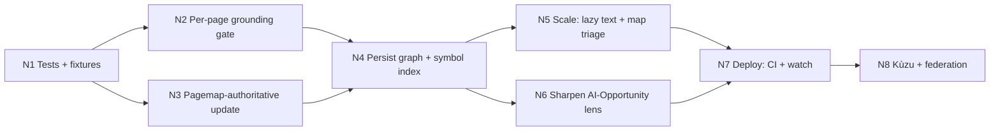

# CodeWiki — Improvements: What's Wrong & What's Next

> **What this document is:** an honest, code-grounded audit of the *current* CodeWiki implementation — design decisions that are wrong or suboptimal, correctness risks, and a prioritized plan for what to do next. Companion to [`ARCHITECTURE.md`](ARCHITECTURE.md) and [`WORKFLOWS.md`](WORKFLOWS.md).
>
> Verified against the codebase: **2026-06-09.** This supersedes the earlier [`logs/improve.md`](logs/improve.md), which described an older state (before the LLM, graph, lenses, and hybrid retrieval were wired in).

---

## 0. TL;DR

The hard part is **done and working**: the LLM is wired into generation (map→reduce, graph-grounded prompts), the code graph is correct and used everywhere, retrieval is hybrid, incremental update is page-targeted, and lenses make it a platform. **The current risks are not capability — they're safety nets and scale:**

1. **No automated tests** — the single biggest risk for a system this interconnected.
2. **A few coarse design decisions** that cause quality cliffs and duplicated logic.
3. **Scale & cost hardening** for large repos (memory, per-file LLM calls).
4. **Deployment surfaces** (CI, daemon, federation) are absent.

Nothing below is a "rewrite." These are targeted corrections.

---

## 1. Correctness & design problems (prioritized)

### 🔴 P1 — No test suite at all
**Evidence:** there is no `tests/` directory in the repo.
**Why it's wrong:** CodeWiki has ~30 interlocking modules (parser → graph → summarizer → generator → updater → retriever). A change in, say, citation format silently breaks pagemap, lint, and incremental update at once. Right now there is **no regression net**.
**Fix:**
- Golden fixtures: tiny repos (`tests/fixtures/py`, `/js`) with snapshot-tested page structure.
- Unit tests for the high-leverage pure functions: import resolution, `Symbol.calls` extraction, citation resolution, `resolve_affected_pages`, RRF fusion, JSON repair/coercion.
- An offline test that mocks the LLM endpoint (assert fallback wiki still generates).
- A grounding assertion: ≥95% of generated citations **resolve** on fixtures.
**Effort:** M · **Impact:** Highest (unblocks safe iteration).

---

### 🔴 P2 — Strict-grounding is a global cliff, not per-page
**Evidence:** [generator.py](../codewiki/wiki/generator.py) — `if cfg.wiki.strict_grounding and summary_bundle.system_summary.confidence == "low": summary_input = None`.
**Why it's wrong:** one low-confidence **system-level** rollup throws away the **entire** `SummaryBundle` — including perfectly good high-confidence *file* and *module* summaries — and falls back to static template text for the whole wiki. A single weak signal nukes all the LLM value.
**Fix:** gate **per page / per claim**, not globally. Keep high/medium-confidence summaries; only suppress (or mark `confidence: low` + a caveat) the specific low-confidence pieces. System confidence should influence the executive summary's caveat, not delete everything.
**Effort:** S · **Impact:** High (directly affects output quality).

---

### 🟠 P3 — Duplicated page-path logic in the updater
**Evidence:** [updater.py](../codewiki/wiki/updater.py) `_predict_pages(...)` hardcodes `components/{slug}.md`, `capabilities/{slug}.md`, `domain/glossary.md`, etc. — the **same naming conventions** that [generator.py](../codewiki/wiki/generator.py) owns. It runs *in addition to* the precise `resolve_affected_pages` (pagemap).
**Why it's wrong:** two sources of truth for "what page does this map to." If the generator renames or restructures pages, `_predict_pages` silently drifts and `update` regenerates the wrong set. The pagemap already answers this precisely.
**Fix:** make the pagemap authoritative; reduce `_predict_pages` to only the genuinely *global* pages (tech-stack, component-graph, executive-summary on add/remove) or delete it once pagemap coverage is proven by tests.
**Effort:** S · **Impact:** Medium (robustness of the headline "incremental" feature).

---

### 🟠 P4 — Framework detection exists in two places
**Evidence:** [detectors.py](../codewiki/signals/detectors.py) `_detect_frameworks` (keywords like `@restcontroller`, `fastapi`, `flask`, `express`) **and** [repo_map.py](../codewiki/ingest/repo_map.py) `_FRAMEWORK_HINTS` (a different dict). Two independent detectors that can disagree.
**Why it's wrong:** the wiki's "Tech Stack" page and the signal-pack selection can report **different frameworks** for the same repo.
**Fix:** one framework-detection function (ideally graph/AST-aware, not raw-text substring), consumed by both repo_map and the pack registry.
**Effort:** S · **Impact:** Medium (consistency + correctness of pack loading).

---

### 🟠 P5 — Graph + ingest rebuilt from scratch on every command
**Evidence:** `run_generate`, `run_impact`, and `run_chat` (with `--source`) each independently `walk_source → parse_symbols → build_repo_map → CodeGraph.build_from_repo`. Nothing is persisted.
**Why it's wrong:** `impact` and `chat` re-ingest and re-parse the **entire repo** just to answer one question — slow and wasteful on large codebases. The graph built during `generate` is thrown away.
**Fix:** persist a compact graph artifact (e.g., `.codewiki_cache/graph.json`) and a symbol index during `generate`; have `impact`/`chat` load it (rebuild only if the manifest hash drifted). This also sets up the Kùzu seam.
**Effort:** M · **Impact:** Medium-High (latency + cost for `impact`/`chat`).

---

### 🟡 P6 — Walker loads the entire repo's text into memory
**Evidence:** [walker.py](../codewiki/ingest/walker.py) builds `FileRecord(text=...)` for **every** file and returns the full list; downstream stages also retain it.
**Why it's wrong:** for 500k+ LOC this is a large, avoidable memory footprint (NFR in the PRD targets ~1M LOC). The plan itself flags this.
**Fix:** make `FileRecord.text` lazy (load on demand by path+hash), or stream files through the pipeline in batches. Cap retained text after summarization (the cache holds what's needed).
**Effort:** M · **Impact:** Medium (scale headroom).

---

### 🟡 P7 — Map stage is one LLM call per file, with no triage
**Evidence:** [summarizer.py](../codewiki/wiki/summarizer.py) `_summarize_files_map` creates a task per file.
**Why it's wrong:** first-run cost/throughput on a big repo scales linearly with file count, including trivial files (`__init__.py`, generated code, config). No "skip-trivial" or "batch-small-files" heuristic.
**Fix:** skip/aggregate low-value files (tiny, generated, vendored); optionally batch several small files into one prompt; let `token_budget` + `max_files` bound a first pass. (Caching already covers re-runs.)
**Effort:** M · **Impact:** Medium (first-run cost).

---

### 🟡 P8 — AI-Opportunity detectors are coarse regex on raw text
**Evidence:** [lenses/ai_opportunity.py](../codewiki/lenses/ai_opportunity.py) — e.g. `hardcoded_thresholds = \b(threshold|limit|max|min|cutoff|score)\b|(?:>=|<=|>|<)\s*\d+` and `rule_engine_density = \b(if|elif|else if|switch|case|rule[s]?)\b`.
**Why it's wrong:** these match enormous numbers of ordinary lines (`max(...)`, every `if`), so the "opportunity" scoring is noisy and over-triggers — undermining the credibility of the marquee banking use case.
**Fix:** raise specificity — require clusters/density thresholds (e.g., N matches in one function), use symbol/graph context (a *function* that is mostly branching), and weight by `lens.scoring` against graph centrality. Tighten patterns and add negative filters.
**Effort:** M · **Impact:** Medium (quality of the flagship lens).

---

### 🟡 P9 — Placeholder `:L1-L1` citations in the offline fallback path
**Evidence:** component pages use real `module_summary.citations` when summaries exist, but the **no-LLM fallback** still emits `:L1-L1`. Lint then flags these as `placeholder_citations`.
**Why it's wrong:** the offline wiki self-reports as low-quality (placeholder citations), and pagemap symbol-provenance for those pages is weak.
**Fix:** in the fallback, cite the file's true symbol line ranges (the parser already has them) instead of `:L1-L1`.
**Effort:** S · **Impact:** Low-Medium (offline quality + lint signal-to-noise).

---

### 🟡 P10 — `asyncio.run` nesting risk between viewer and chat
**Evidence:** [chat.py](../codewiki/query/chat.py) `answer_question` calls `asyncio.run(...)`; the FastAPI viewer ([viewer/app.py](../codewiki/viewer/app.py)) calls `run_chat` from a request handler.
**Why it's a risk:** if the viewer's chat route is an `async def`, calling `asyncio.run` inside the already-running event loop raises `RuntimeError: asyncio.run() cannot be called from a running event loop`. (It's fine only if the route is a sync `def` dispatched to a threadpool.)
**Fix:** expose an async `answer_question_async` and `await` it directly from the viewer; keep the sync `asyncio.run` wrapper only for the CLI. **Verify the current route signature.**
**Effort:** S · **Impact:** Medium (viewer chat reliability).

---

### ⚪ P11 — Minor consistency items
- **Multiple `LLMClient` lifecycles per run:** map, module-reduce, system-reduce, and the vector store each open/close their own `httpx.AsyncClient`. Sharing one client across stages would reuse connections.
- **`detect_signals` concatenates `file.text` for all files** to sniff frameworks — another full-text pass in memory (ties into P6).
- **Stale CLI docstring:** [cli.py](../codewiki/cli.py) still says "Phase 0 / Coming in later phases" though all commands are implemented.
- **`Symbol.calls` for JS/TS** is low-fidelity (regex) vs. Python AST — acceptable, but worth documenting per-language confidence.

---

## 2. Capability gaps (planned but not built)

| Gap | Status | Notes |
|---|---|---|
| **Kùzu graph backend** | Not started | `GraphBackend` seam exists; only `NetworkXBackend` today. Needed for very large graphs / federation. |
| **Multi-repo federation** | Not started | Per-repo subgraphs → org capability graph (breaks knowledge silos). |
| **CI/CD job** | Not started | On merge → `update` → publish wiki artifact/Pages (the "freshness" promise). |
| **Daemon / `watch`** | Not started | Webhook/debounce → incremental update → PR changelog comment. |
| **Bounded-memory ingest** | Partial | See P6. |
| **tree-sitter wheels** | Unverified | Java/Go/C# parsing depends on optional grammar wheels being installed (esp. on Windows). |

---

## 3. Recommended next steps (sequenced)

**Principle: lock in correctness with tests, fix the cheap-but-high-impact design cliffs, then harden for scale.**

| Step | Work | Fixes | Effort | Impact |
|---|---|---|---|---|
| **N1** | Test suite + golden fixtures + mocked-LLM offline test + grounding assertion | P1 | M | 🔴 Highest |
| **N2** | Per-page/per-claim grounding gate; keep good summaries | P2 | S | 🔴 High |
| **N3** | Make pagemap authoritative; trim/retire `_predict_pages`; unify framework detection | P3, P4 | S | 🟠 Med-High |
| **N4** | Persist graph + symbol index from `generate`; load in `impact`/`chat` | P5 | M | 🟠 Med-High |
| **N5** | Lazy file text + map-stage triage (skip/batch trivial files) | P6, P7, P11 | M | 🟡 Med |
| **N6** | Tighten AI-Opportunity detectors (density + graph context + scoring) | P8 | M | 🟡 Med |
| **N7** | CI `update` job + `codewiki watch` daemon + Pages export; fix viewer async (P10); fallback citations (P9) | gaps, P9, P10 | M | 🟡 Med |
| **N8** | Kùzu backend behind `GraphBackend`; multi-repo federation | gaps | L | 🟢 Later |

**A good first PR (highest ROI, lowest risk):** **N1 + N2 + N3** together — they make the system safe to change *and* immediately improve output quality and update correctness, with mostly small diffs.

---

## 4. What is explicitly *right* (don't regress these)

So future work doesn't "fix" things that are correct:
- ✅ Facts-vs-meaning split (graph/parser state facts; LLM narrates).
- ✅ Graph neighbor context injected into summarizer prompts (strong anti-hallucination).
- ✅ Hash-keyed summary cache → cheap re-runs.
- ✅ Hybrid retrieval (BM25 + optional vectors via RRF + graph boost) with graceful fallbacks.
- ✅ Provider-agnostic LLM client returning real `usage`; budget + `--dry-run`.
- ✅ Human-edit safety in `update` (locked pages → `.proposed.md`, never silent overwrite).
- ✅ Pluggable lenses / signal packs / parser backends / graph backend seams.

---

## 5. Open questions (decisions to make)

1. **Grounding policy:** for P2 — allow `confidence: low` inferred claims with a caveat, or suppress them entirely?
2. **First-run cost ceiling per repo** (e.g., 200k LOC) — sets how aggressive N5 triage must be.
3. **Embedding default:** recommended local embedding endpoint (e.g., `nomic-embed-text` on Ollama) to make `embedding.enabled` turnkey.
4. **Federation timing:** is multi-repo (N8) needed soon, or is single-repo depth the priority?
5. **`chat --file-back` review gate:** require a `[DRAFT]`/human review before answers enter the wiki, to prevent self-pollution?
