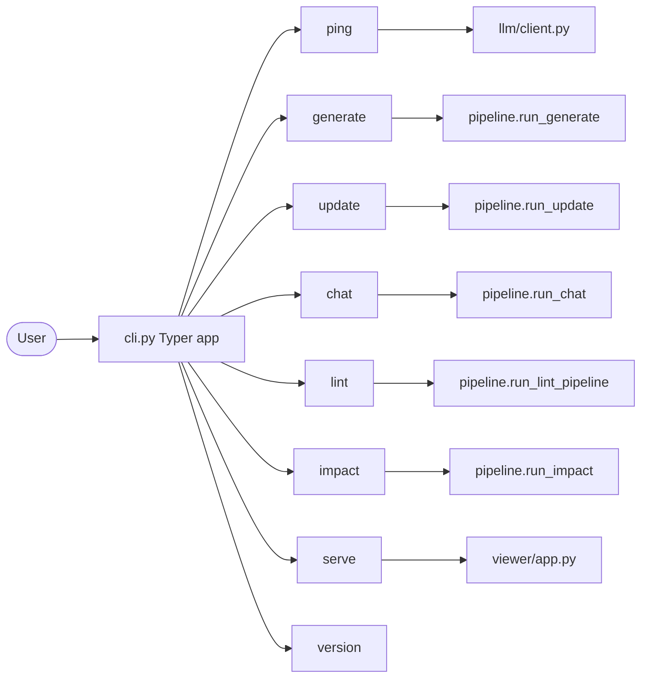
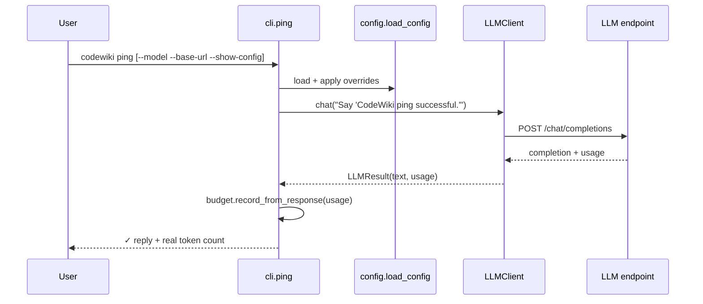
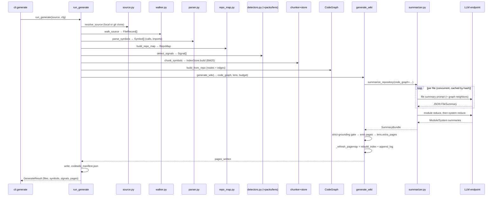
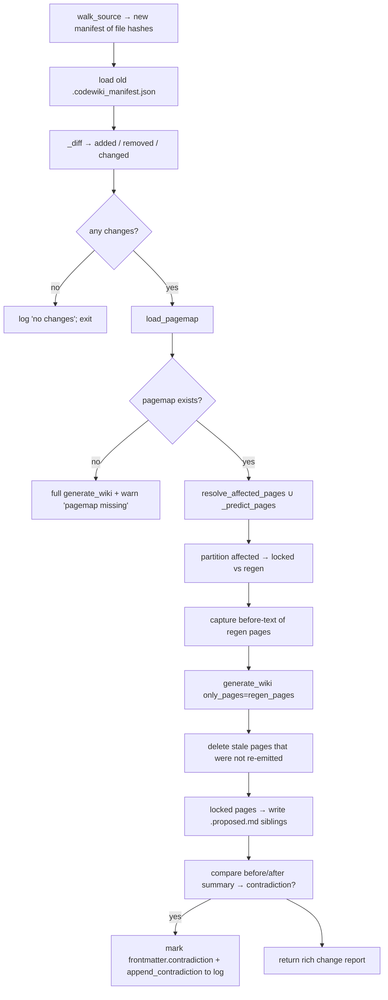
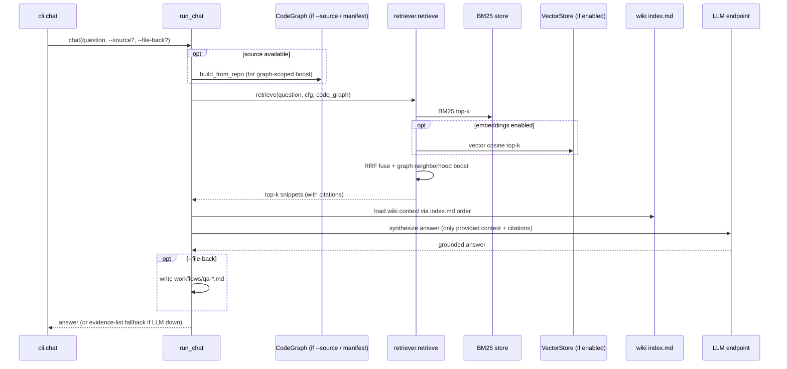
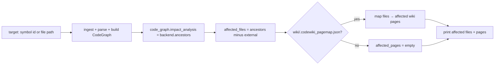
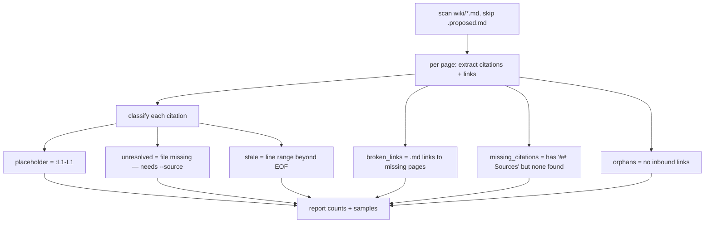
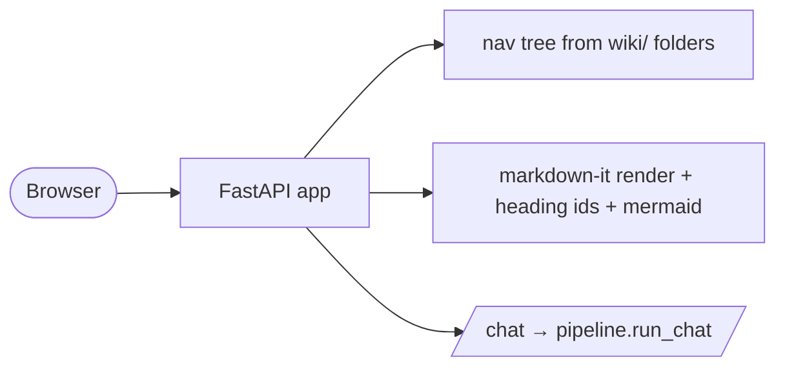
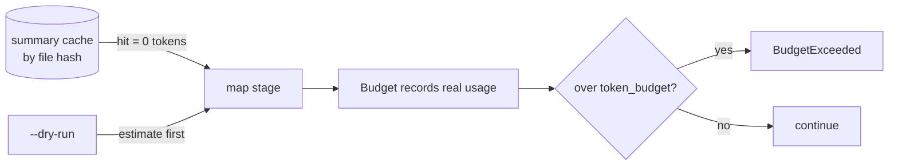

# CodeWiki — Command Workflows

> **What this document is:** step-by-step flows for every CLI command, showing which modules run, in what order, and where the LLM / graph / cache get involved. Companion to [`ARCHITECTURE.md`](ARCHITECTURE.md) (the static structure) and [`IMPROVEMENTS.md`](IMPROVEMENTS.md) (gaps).
>
> Verified against the codebase: **2026-06-09.** Entry points: [cli.py](../codewiki/cli.py) → [pipeline.py](../codewiki/pipeline.py).

---

## 0. CLI map

Every command first calls `_load_cfg(...)` which merges `codewiki.yaml` → `.env` → env vars → CLI flags into a `CodeWikiConfig`.

---

## 1. `ping` — verify the LLM endpoint

The smoke test that proves the configurable endpoint works.

**Why it matters:** confirms `base_url`/`model`/`api_key` and returns **real** token usage (not a hardcoded estimate).

---

## 2. `generate` — build the full wiki

The main event. `run_generate` in [pipeline.py](../codewiki/pipeline.py).

### `--dry-run` variant
Runs ingest → parse → signals, then `estimate_repository_tokens` (which includes graph neighbor context size) and prints a cost table. **Writes nothing.**

### Offline / endpoint-down behavior
If `summarize_repository` raises, `generate_wiki` catches it, sets `summary_bundle = None`, and emits a **static fallback wiki** (structural facts only). The tool always produces output.

---

## 3. `update` — incremental, diff-aware refresh

The "compounding artifact" mechanism. `update_wiki` in [updater.py](../codewiki/wiki/updater.py).

Key behaviors:
- **Targeted regen:** only pages whose source provenance intersects changed files are rewritten (`only_pages`); the summary cache makes unchanged files free.
- **Human-edit safety:** pages with `human_edited` or a `<!-- codewiki:locked -->` marker are **never overwritten** — a `.proposed.md` sibling is written instead.
- **Contradiction tracking:** if a regenerated page's `## Summary` materially changes, it's flagged and logged.

> ⚠️ **Design note:** affected pages are resolved **twice** — precisely via `resolve_affected_pages` (pagemap) *and* heuristically via `_predict_pages` (which hardcodes page-path conventions). See [IMPROVEMENTS.md](IMPROVEMENTS.md) §Duplicated page-path logic.

---

## 4. `chat` — grounded Q&A (hybrid retrieval)

`run_chat` → `answer_question` in [chat.py](../codewiki/query/chat.py).

- **Graph scope is optional:** with `--source` (or a recorded manifest source), a real `CodeGraph` boosts structurally-related snippets; otherwise a metadata (symbol-sharing) fallback boost is used.
- **Fallback:** if the endpoint is unavailable, the answer degrades to a citation-backed evidence list — never empty.

---

## 5. `impact` — "what breaks if I change X?"

`run_impact` → [impact.py](../codewiki/query/impact.py).

Answers the impact-radius question by walking **graph ancestors** (everything that transitively depends on the target), then maps those files to wiki pages via the pagemap.

---

## 6. `lint` — wiki health

`run_lint_pipeline` → [health.py](../codewiki/lint/health.py).

> Citation **resolution** (vs. mere presence) requires `--source` so it can open the referenced files and check line ranges.

---

## 7. `serve` — local web viewer

`create_app` in [viewer/app.py](../codewiki/viewer/app.py) (FastAPI + markdown-it). Renders the `wiki/` tree with a nav sidebar (grouped by folder), injects heading anchors, renders Mermaid, and exposes a chat panel that calls `run_chat` under the hood.

---

## 8. Cross-cutting: how cost stays bounded

- First run pays per file; **re-runs are near-free** thanks to hash caching.
- `--dry-run` estimates before spending; `token_budget` hard-stops a runaway run.
- Vectors are signature-cached and only computed when `embedding.enabled`.

---

## 9. Quick reference — module touchpoints per command

| Command | source | walker | parser | repo_map | signals | graph | index | summarizer | generator | retriever | LLM |
|---|:--:|:--:|:--:|:--:|:--:|:--:|:--:|:--:|:--:|:--:|:--:|
| `ping` | | | | | | | | | | | ✅ |
| `generate` | ✅ | ✅ | ✅ | ✅ | ✅ | ✅ | ✅ | ✅ | ✅ | | ✅ |
| `update` | ✅ | ✅ | ✅ | ✅ | ✅ | | | ✅* | ✅ | | ✅* |
| `chat` | ✅? | ✅? | ✅? | ✅? | | ✅? | ✅ | | | ✅ | ✅ |
| `impact` | ✅ | ✅ | ✅ | ✅ | | ✅ | | | | | |
| `lint` | ✅? | | | | | | | | | | |
| `serve` | | | | | | | ✅ | | | ✅ | ✅ |

✅ = always, ✅* = via `generate_wiki` for affected pages, ✅? = only when `--source` is supplied.
